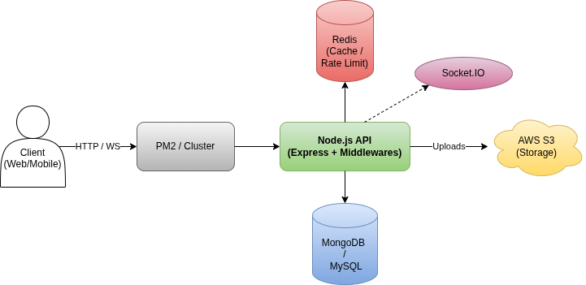

# Node.js Scalable Boilerplate  
### MySQL + MongoDB + JWT Auth + i18n + File Upload + Socket.io


A production-ready Node.js boilerplate for building secure, scalable, and maintainable backend applications.  
This boilerplate integrates **REST APIs**, **JWT authentication**, **multi-language support**, **file uploads**, **MySQL + MongoDB**, and **real-time communication using Socket.io**.

---

## 📑 Table of Contents

- [Features](#-features)
- [Boilerplate Overview](#-boilerplate-overview)
- [Tech Stack](#-tech-stack)
- [Folder Structure](#-folder-structure)
- [Setup & Installation](#-setup--installation)
- [Environment Variables](#-environment-variables)
- [Database Setup (MySQL)](#-database-setup-mysql)
- [Running the Project](#-running-the-project)
- [Localization (i18n)](#-localization-i18n)
- [File Uploads](#-file-uploads)
- [Socket.io + Redis](#-socketio--redis)
- [API Overview](#-api-overview)
- [Testing](#-testing)
- [Contributing](#-contributing)
- [License](#-license)

---

## 🚀 Features

- 🔐 **JWT Authentication**  
- ✔️ **Email verification** using Nodemailer  
- 💾 **MySQL support (Sequelize)** — with migrations & seeders  
- 📦 **MongoDB support (Mongoose)**  
- 🌍 **Internationalization (i18n)** based on `Accept-Language` header  
- 📁 **File Uploads** (Local storage in dev, AWS S3 in production)  
- ☁️ **AWS Presigned URLs** for secure uploads
- 🔥 **Socket.io real-time support** (with Redis adapter for scaling)  
- 📝 **Logging Control** (Disable console logs in production)  
- 📊 **Offset-based Pagination** (limit + page)  
- 🧱 **Clean, scalable architecture** (controllers, services, middlewares, utils)  
- 🛠️ Works with **class-based or functional approach**  
- 🧩 Modular & production-ready boilerplate  

---

## 🏗️ Boilerplate Overview

This boilerplate is ideal for:
  - SaaS backends
  - Microservice architectures
  - Real-time apps using WebSockets

```
                       ┌──────────────────────────┐
                       │        Client App        │
                       └────────────┬─────────────┘
                                    │
                            REST / Socket.io
                                    │
     ┌──────────────────────────────┴──────────────────────────────┐
     │                         Node.js API                         │
     │                                                             │
     │   Controllers  →  Services  →  Repositories/Models          │
     │                                                             │
     │   Middlewares: Auth, i18n, Validation, Error Handling       │
     └──────────────┬──────────────────────────────────────────────┘
                    │
      ┌─────────────┼──────────────────────────┬─────────────────────┐
      │             │                          │                     │
  MySQL (SQL)   MongoDB (NoSQL)            Redis Cache         AWS S3 Storage
 (Sequelize)      (Mongoose)          (Socket adapter, etc.)   (Production files)
```


---

## 🧰 Tech Stack

- **Runtime**: Node.js  
- **Databases**: MySQL (Sequelize), MongoDB (Mongoose)  
- **Cache & Scaling**: Redis  
- **Email**: Nodemailer  
- **File Storage**: Local / AWS S3  
- **Real-time**: Socket.io + Redis adapter  
- **i18n**: JSON locale files  
- **Authentication**: JWT (access & refresh tokens)  

---

## 📂 Folder Structure

```
/controllers       → API route controllers
/services          → Business logic
/models            → Sequelize + Mongoose models
/routes            → API routes
/middlewares       → Auth, validation, i18n, error handling
/config            → Database, SMTP, AWS, Redis config
/utils             → Helpers (email, file uploads, logging, etc.)
/locales           → Language JSON files
/public            → Uploads (dev mode)
```

---

## 🛠️ Setup & Installation

```bash
git clone https://github.com/devendra-rajput/nodejs-production-boilerplate.git
cd nodejs-production-boilerplate
npm install
cp .env.example .env
```

---

## 🔧 Environment Variables

Update your `.env`:

- **MySQL**: DB_HOST, DB_USER, DB_PASS, DB_NAME  
- **MongoDB**: MONGO_URI  
- **Redis**: REDIS_HOST, REDIS_PORT  
- **JWT**: ACCESS_SECRET, REFRESH_SECRET  
- **SMTP**: EMAIL_HOST, EMAIL_USER, EMAIL_PASS  
- **AWS S3** (optional for production)  
- **SERVER PORT**, **BASE_URL**, etc.  

---

## 🗄️ Database Setup (MySQL)

```bash
npx sequelize-cli db:drop
npx sequelize-cli db:create
npx sequelize-cli db:migrate
npx sequelize-cli db:seed:all
```

---

## ▶️ Running the Project

### Development
```bash
npm run dev
```

### Production
To run in single Instance Mode
```bash
npm run dev:prod
```

Use PM2 to run in cluster mode:
```bash
pm2 start ecosystem.config.js --env production
```

---

## 🌍 Localization (i18n)

- Accepts language via `Accept-Language` header  
- Example:  
  ```
  Accept-Language: en
  Accept-Language: es
  ```
  Language files are stored under:

  ```
  /locales/en.json
  /locales/es.json
  ```

## 📝 Logging Configuration

  To disable `console.log` output (useful for production/testing to reduce noise), set:
  ```env
  LOG_DISABLE=true
  ```
---

## 📁 File Uploads

### Development
- Files stored locally in `/public/uploads`

### Production
- Uploads go to **AWS S3** via official SDK
- **Presigned URLs**: Securely generate upload URLs for clients.
- **Cleanup**: Auto-deletion of local files after upload (if applicable).

**Required Environment Variables**:
```env
AWS_REGION=us-east-1
AWS_ACCESS_KEY=your_key
AWS_SECRET_ACCESS_KEY=your_secret
AWS_S3_BUCKET_NAME=your_bucket
```  

---

## 🔌 Socket.io + Redis

Supports scalable WebSocket communication:

- Real-time events  
- Multi-instance support with Redis adapter  
- Ready for microservices / cluster mode  

---

## 📬 API Overview

Includes built-in routes for:

- User registration  
- Email verification  
- Login & refresh token  
- File uploads  
- Pagination  
- Socket initialization  

*(See `/routes` folder for detailed endpoints.)*

---

## 🧹 Code Quality

This project uses **ESLint** with the **Airbnb Base** style guide and **eslint-plugin-security** to maintain consistent code quality, enforce best practices, and prevent common bugs across the codebase. **ESLint** helps ensure that all contributors follow the same coding standards, improving readability and long-term maintainability.

-   **Airbnb Base**: Enforces best practices for JavaScript (var usage, equality, spacing, etc.).
-   **Security Plugin**: Checks for vulnerabilities like unsafe regex (ReDoS), `eval()` usage, and child process misuse.
-   **Centralized Config**: Configuration is managed centrally in `.eslintrc.js` at the root, ensuring consistency across all services.

**Run Linter**:
```bash
npm run lint
```

**Fix Linting Issues**:
```bash
npm run lint:fix
```
---

## 🤝 Contributing

1. Fork this repository  
2. Create a feature branch  
3. Commit your changes  
4. Push to your branch  
5. Open a Pull Request  

We follow clean code, modular components, and industry best practices.

---

## 📄 License

This project is released under the **MIT License**.

---

## ⭐ Support

If you find this useful, please **star the repo** — it motivates more improvements!

---

## 👤 Author

**Devendra Kumar**  
Full-Stack Developer  
Portfolio: www.devrajput.in  
GitHub: https://github.com/devendra-rajput
